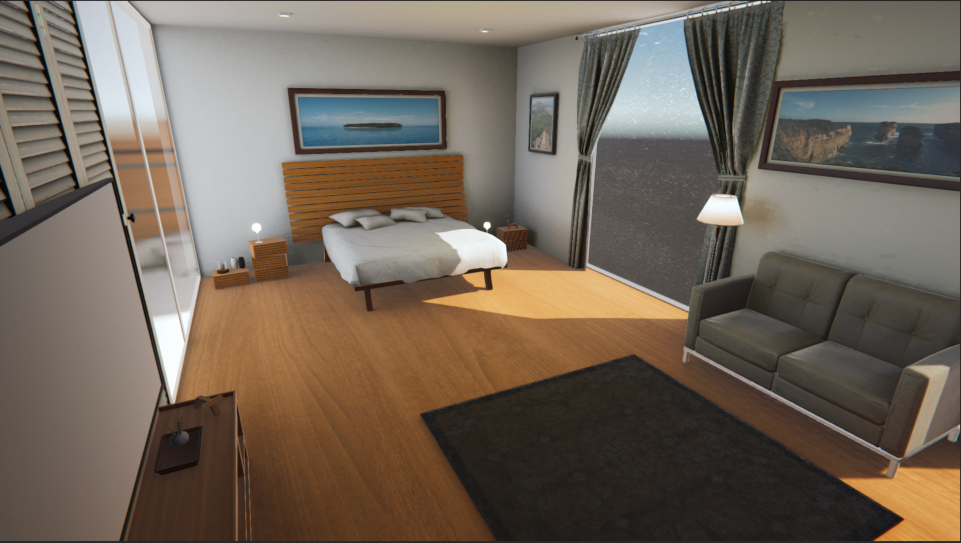

# My Interior Design
Practicing lightmapping in Unity. 

"There are many realistic samples of interior design available on Unity and Unreal today. We just need to set up the lightmap properly, and everything will be automatically taken care of. However, that's easier said than done."

